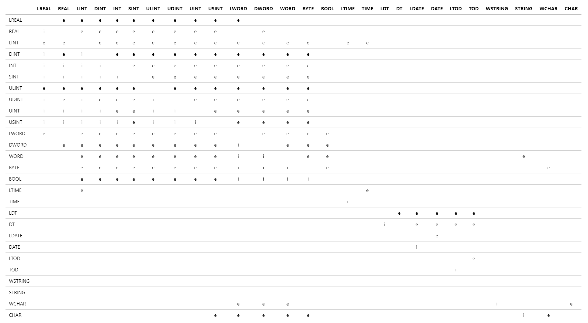
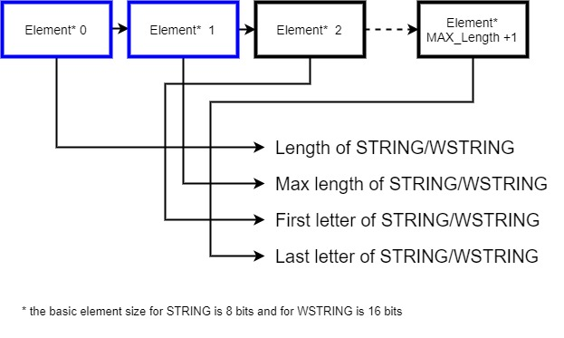

# Types and Variables

Structured text offers a huge a variety of different data types. A data type specifies, how a given address in memory (which is named by a variable's name) is to be interpreted, i.e. how many bytes does a variable cover and how is it interpreted.

Some of the data types are already predefined by the ST language, while others may be defined by the user on demand.

The following paragraphs describe the supported data types.

## Elementary data types

Elementary types are types, already embedded inside the language itself.

### Supported Elementary Data Types

The following elementary data types are supported:

| Type             | Literal example                  | Domain range                                           | Size                                                | Default                  |
| :--------------- | :------------------------------- | :----------------------------------------------------- | :-------------------------------------------------- | :----------------------- |
| `BOOL`           | `TRUE`                           | `0` ‥ `1`                                              | `1` bit unsigned                                    | `0` or `FALSE`           |
| `BYTE`           | `BYTE#2#1111_0101`               | `0` ‥ `255`                                            | `8` bit unsigned                                    | `0`                      |
| `WORD`           | `WORD#60000`                     | `0` ‥ `65535`                                          | `16` bit unsigned                                   | `0`                      |
| `DWORD`          | `DWORD#16#ABCD_EF01`             | `0` ‥ `4294967295`                                     | `32` bit unsigned                                   | `0`                      |
| `LWORD`          | `LWORD#55`                       | `0` ‥ `18446744073709551615`                           | `64` bit unsigned                                   | `0`                      |
| `SINT`           | `SINT#-5`                        | `-128` ‥ `127`                                         | `8` bit signed                                      | `0`                      |
| `INT`            | `-5`                             | `-32768` ‥ `32767`                                     | `16` bit signed                                     | `0`                      |
| `DINT`           | `DINT#-56`                       | `–2147483648` ‥ `2147483647`                           | `32` bit signed                                     | `0`                      |
| `LINT`           | `LINT#512`                       | `-9223372036854775808` ‥ `9223372036854775807`         | `64` bit signed                                     | `0`                      |
| `USINT`          | `USINT#5`                        | `0` ‥ `255`                                            | `8` bit unsigned                                    | `0`                      |
| `UINT`           | `UINT#512`                       | `0` ‥ `65535`                                          | `16` bit unsigned                                   | `0`                      |
| `UDINT`          | `UDINT#512`                      | `0` ‥ `4294967295`                                     | `32` bit unsigned                                   | `0`                      |
| `ULINT`          | `ULINT#512`                      | `0` ‥ `18446744073709551615`                           | `64` bit unsigned                                   | `0`                      |
| `REAL`           | `REAL#5.0`                       | `-3.402823e+38` ‥ `+3.402823e+38`                      | `32` bit (`23` bit significant, `8` bit exponent )  | `0.0`                    |
| `LREAL`          | `3.14159`                        | `-1.79769313486231e+308` ‥ `1.79769313486231e+308`     | `64` bit (`52` bit significant, `11` bit exponent ) | `0.0`                    |
| `TIME`           | `TIME#1d2h4m8s16ms`              | `–2147483648ms` ‥ `2147483647ms`                       | `64` bit signed                                     | `TIME#0ms`               |
| `LTIME`          | `LTIME#100000d2h4m8s16ms32ns`    | `-9223372036854775808ns` ‥ `9223372036854775807ns`     | `64` bit signed                                     | `LTIME#0ns`              |
| `DATE`           | `DATE#1980-01-23`                | `1970-01-01` ‥ `2262-04-11`                            | `64` bit signed                                     | `DATE#1970-01-01`        |
| `LDATE`          | `LDATE#1980-01-23`               | `1970-01-01` ‥ `2262-04-11`                            | `64` bit signed                                     | `LDATE#1970-01-01`       |
| `TIME_OF_DAY`    | `TOD#13:14:33.123`               | `0:0:0.0` ‥ `23:59:59.999999999`                       | `64` bit signed                                     | `TOD#0:0:0.0`            |
| `LTIME_OF_DAY`   | `LTOD#13:14:33.123456`           | `0:0:0.0` ‥ `23:59:59.999999999`                       | `64` bit signed                                     | `LTOD#0:0:0.0`           |
| `DATE_AND_TIME`  | `DT#1980-01-23-13:14:33.123`     | `1970-01-01-0:0:0.0` ‥ `2262-04-11-23:47:16.854775807` | `64` bit signed                                     | `DT#1970-01-01-0:0:0.0`  |
| `LDATE_AND_TIME` | `LDT#1980-01-23-13:14:33.123456` | `1970-01-01-0:0:0.0` ‥ `2262-04-11-23:47:16.854775807` | `64` bit signed                                     | `LDT#1970-01-01-0:0:0.0` |
| `CHAR`           | `CHAR#'C'`                       | `0` ‥ `255`                                            | `8` bit                                             | `CHAR#0`                 |
| `WCHAR`          | `WCHAR#"W"`                      | `0` ‥ `65535`                                          | `16` bit                                            | `WCHAR#0`                |
| `STRING`         | `STRING#'ABC'`                   |                                                        | `1`-`254` characters                                | `''`                     |
| `WSTRING`        | `WSTRING#"ABC"`                  |                                                        | `1`-`16328` wide characters                         | `""`                     |

Notes:

- Decimal literals can be encoded as hexadecimal (`16#`) or decimals. Grouping with `_` is supported.\
  Example: The decimal number `32767` can be coded as:

```sh
  INT#16#7FFF
  DINT#16#7FFF_ABCD
  INT#32767
  32767
```

- Boolean literals can be encoded using:

```sh
  TRUE, FALSE
  BOOL#1, BOOL#0
```

- Not explicitly typed decimal literals are implicitly typed as `INT`.
- Not explicitly typed real literals are implicitly typed as `LREAL`.
- Everything is strictly typed, means there is no implicit type conversion, yet!\
  E.g.: A statement `a := 5`, where `a` is typed as `LINT` is rejected.

## Initialization of elementary types

Every elementary type will be initialized by default, in case no custom initialization has been provided by the user. The default initial value for each elementary type can be found [here](#supported-elementary-data-types).

Elementary types may be initialized by appending an assignment of a constant value to the [declaration](./01_program-structure/4_pou-interface.md).

```iecst
VAR_TEMP
    counter : INT := 1;
END_VAR
```

## Type conversion

The following table shows the predefined conversions between types.

- **e**xplicitly assignable,
- **i**mplicitly assignable,
- or not assignable at all.

The source type is shown on the left, whilst the target type is shown on the top.



> TIP
>
> This table lists all available elementary types in the ST language; some of which may not be available in the current implementation. Please refer to the [supported types](#supported-elementary-data-types) for the definitive list of supported types.

### Explicit conversion

In order to explicitly convert a data type into another one, a conversion function of the scheme `TO_<DEST_TYPE>(<SOURCE_VALUE>)` must be used. For each `TO_<DEST_TYPE>` there are a few overloading functions, from which the compiler chooses the correct conversion according to the source type.

> NOTICE
>
> - Explicit type conversion may cause **loss of precision**.
> - When converting a `REAL` or `LREAL` value to an integer type, the value is rounded to the _nearest_ integer and if ambiguous, to the nearest _even_ integer.

#### Example: Explicit type conversion

```iecst
FUNCTION CONVERT_DINT_TO_INT : INT
    VAR_INPUT
        d : DINT;
    END_VAR

    // explicit type conversion
    CONVERT_DINT_TO_INT := TO_INT(d);
END_FUNCTION
```

### Implicit conversion

The compiler will implicitly convert data types as defined in the table above.
Generally speaking, implicit conversion is possible when the value and accuracy of the data type can be maintained, i.e., a _smaller_ data type is converted into a _larger_ data type. Each implicit conversion can also be written explicitly with `TO_<DEST_TYPE>(<SOURCE_VALUE>)`, but the IDE will give you the hint that this explicit conversion is not needed.
Additionally the implicit conversion of limited string typed operands, e.g. `STRING[20]` in standard limited string typed operands (`STRING` which can contain up to 254 characters), is supported. Vice versa, the strings will be truncated. In both cases, only the characters according to the current length of the string is copied.

Implicit conversion of expressions and assignments follows the sequence of [expression evaluation](05_expressions.md):

```iecst
FUNCTION ImplicitConversion
    VAR_TEMP
        i8  : SINT;
        i64 : LINT;
    END_VAR

    // The following two statements are identical:
    i64 := i8 * i8;
    i64 := TO_LINT(i8 * i8);

    // The following two statements are identical:
    i64 := i8 * i8 * i64;
    i64 := TO_LINT(i8 * i8) * i64;

    // The following two statements are identical:
    i64 := i8 * i64 * i8;
    i64 := (TO_LINT(i8) * i64) * TO_LINT(i8);
END_FUNCTION
```

> NOTICE
>
> Although no loss of precision will occur for implicit type conversions, overflows may occur at unexpected operations due to the sequence of **expression evaluation**:
>
> ```iecst
> i8 := SINT#100;
> i64 := LINT#100;
>
> // Overflow will occur for 'i8 * i8'
> i64 := i8 * i8 * i64;
>
> // No overflow will occur
> i64 := i8 * i64 * i8;
> ```

## User-defined data types

User-defined types offer the possibility to declare custom types not known to the type system. These types are declared inside a `TYPE` section. This section can be declared inside a [Namespace](01_program-structure/3_namespaces.md) so that the declared type is part of this namespace. If not contained within a namespace, the type section must be declared with a global scope.

```iecst
NAMESPACE MyTypes
    TYPE
        // Types inside namespace MyTypes
    END_TYPE
END_NAMESPACE

TYPE
    // Global Types
END_TYPE
```

> TIP
>
> A type may contain one or more of the following types:
>
> - [Structured type](#structured-type)
> - [Enumeration](#enumeration)
> - [Data type with named values](#data-type-with-named-values)
> - [Named array](#named-array)

> TIP
>
> A type may declare the following access modifier
>
> - [Public](./03_access-modifier.md#public)
> - [Internal](./03_access-modifier.md#internal)

### Example: User-defined type

```iecst
TYPE
    Motor : STRUCT
        isRunning : Bool;
    END_STRUCT;

    motorCollection : ARRAY[1..3] of Motor;
END_TYPE
```

## Array

An array is a data structure consisting of a collection of elements (values or variables), each identified by at least one array index or key. An array is stored such that the position of each element can be computed from its index tuple by a mathematical formula.The simplest type of an array is a linear array, also called one-dimensional array.

```iecst
ARRAY[0..9] of INT
```

> TIP
>
> An array may contain the following types:
>
> - [Elementary data type](#elementary-data-types)
> - [Structured type](#structured-type)
> - [Enumeration](#enumeration)
> - [Data type with named values](#data-type-with-named-values)
> - [Class](./01_program-structure/2_program-organization-unit.md#class-declaration)

Every array declared is anonymous by default. Meaning, it may be used only inside the declaring [POU](./01_program-structure/2_program-organization-unit.md).

### Example: Array

```iecst
FUNCTION ReturnItemAt : INT
    VAR_INPUT
        sort : ARRAY[0..9] OF INT;
        index : INT;
    END_VAR
    ReturnItemAt := sort[index];
END_FUNCTION
```

### Named array

An array can be declared as a named type like [structured types](#structured-type). The array declaration can then be referred to by type name instead of an anonymous way.

```iecst
TYPE
    FibonacciSequence : ARRAY[0..10] OF INT := [0, 1, 1, 2, 3, 5, 8, 13, 21, 34];
END_TYPE

FUNCTION UseFibSequence : INT
    VAR_INPUT
        Sequence : FibonacciSequence;
        Index : INT;
    END_VAR
    UseFibSequence := Sequence[Index];
END_FUNCTION
```

### Array dimensions

An array may be declared having multiple dimensions, each of them separated by a `,`. A single dimension is given by a lower and an upper boundary. The difference between these boundaries determine the number of elements in that dimension.

```iecst
ARRAY[0..9, 0..9] of INT
```

An array boundary shall be a [constant](#constants). The value of this constant shall be in the range of `[-2147483648..2147483647]`. It is an error to declare an Array dimension with 0 or a negative amount of elements.

> TIP
>
> An array may declare 6 dimensions at most.

> NOTICE
>
> An arrays index may be accessed using only [elementary types](#elementary-data-types) of type _integer_.

#### Example: Array dimensions

```iecst
FUNCTION Arrays
    VAR_INPUT
        oneDimensional : ARRAY[1..10] OF INT;
        twoDimensional : ARRAY[1..10, 1..10] OF INT;
        index : INT;
    END_VAR
    index := 2;
    oneDimensional[1] := oneDimensional[index + 1];
    twoDimensional[index,2] := oneDimensional[2];
END_FUNCTION
```

### Initialization of arrays

The initialization of an array may be done during the declaration. In case an element has no default value, the type specific default will be used as described in [elementary data types](#supported-elementary-data-types).

> TIP
>
> The initial values shall be of the same data type like the element type of the array.

Arrays are initialized starting from the right most dimension. This means, e.g. for a two dimensional array, the first initial value is applied to the index `[0, 0]` followed by `[0, 1]` and so on.

```iecst
FUNCTION Arrays
    VAR_TEMP
        two_dim_array : ARRAY[0..2, 0..2] OF INT := [1, 2, 3, 4, 5, 6, 7, 8, 9];
            // [0, 0] := 1, [0, 1] := 2, [0, 2] := 3
            // [1, 0] := 4, [1, 1] := 5, [1, 2] := 6
            // [2, 0] := 7, [2, 1] := 8, [2, 2] := 9
    END_VAR
    ;
END_FUNCTION
```

#### Repetition Syntax

When initializing large arrays it may become quite cumbersome to state the same initial value for every element over and over again. Here the repetition syntax of the form `count(value)` can be used. For example:

```iecst
FUNCTION Arrays
    VAR_TEMP
        arr : ARRAY[1..100] OF INT := [50(2), 50(3)];
    END_VAR
    ;
END_FUNCTION
```

In this example the first 50 elements will be initialized with '2' and the remaining 50 elements will be initialized with '3'.

> TIP
> In case the amount of given initial values does not match the declared amount of elements, a warning is generated by the compiler. For array elements where no initial value is given, the default value of the Array element type is used as a substitution. Surplus initial values are ignored.

### Accessing an array

Accessing an array shall be done using the index operator. For every declared [array dimension](#array-dimensions) an index expression of signed integer type has to be provided. This has to be either a constant expression or an expression that evaluates to an integer value in the range.
For constant expressions a compile time check is done that checks that the index does not exceed the declared bound of the accessed dimension. For variable indices a runtime error will occur if the index addresses out of the array bounds.

`[lower bound <= index <= upper bound]`

```iecst
FUNCTION Arrays
    VAR_TEMP
        arr : ARRAY[1..10] OF INT;
        index : INT;
    END_VAR
    index := 2;

    // valid accesses
    arr[1] := 1;
    arr[index] := 1;
    arr[index + 1] := 1;

    // invalid accesses that throw an error
    arr[0] := 1;
    arr[11] := 1;
    arr[10 + 1] := 1;
END_FUNCTION
```

## Variable-length array

An array with variable length can be declared using one or more `*`, each of which stands for one dimension. For example:

```iecst
VAR_IN_OUT
    oneDimArray: ARRAY [*] OF INT;
    sixDimArray: ARRAY [*, *, *, *, *, *] OF REAL;
END_VAR
```

> TIP
>
> When declaring a variable-length array, the bounds of all its dimensions shall be declared as variable. Declaring an array which contains both fixed bounds and variable bounds, e.g. ARRAY [1..2, * , 0..3] or ARRAY [*..5], is not supported.

A variable-length array can ONLY be declared in the following variable sections:

- input, output or in-out section of [methods](./01_program-structure/2_program-organization-unit.md#method-declaration) and [functions](./01_program-structure/2_program-organization-unit.md#function-declaration)
- in-out section of [Function block](./01_program-structure/2_program-organization-unit.md#function-block-declaration)

When calling a POU with a variable-length array as formal parameter, the corresponding actual parameter can be either a fixed-length array or a variable-length array.

> TIP
>
> A variable-length array cannot be initialized in the variable
> sections, e.g. myVariableLengthArray: Array [*] OF INT := [1, 2, 3];
>
> A variable-length array as a whole cannot be used in an assignment statement in the code body, e.g. myFixedLengthArray := myVariableLengthArray;
>
> In case the used index exceeds the bounds in runtime when accessing an element of variable-length array, the error may lead to stop of the PLC.

Together with the built-in functions of `LOWER_BOUND` and `UPPER_BOUND`, variable-length arrays are especially useful for implementing algorithms on arrays, when their actual bounds of each dimension are unknown during compile time. Following example shows the calculation of average value of all elements in a matrix _A_ (2-dimensional array), as well as the generation of its transpose _A_<sup>T</sup>. Please note that the return value of `LOWER_BOUND` or `UPPER_BOUND` has the type of DINT.

```iecst
PROGRAM P1
    VAR
        A: ARRAY[1..2, 1..3] of INT := [1, 2, 3, 4, 5, 6];
        average: REAL;
        A_Transpose: ARRAY [1..3, 1..2] of INT;
    END_VAR
    average := GetAverage(A);
    MatrixTranspose(A, A_Transpose);
END_PROGRAM


FUNCTION GetAverage : REAL
    VAR_INPUT
        matrix: ARRAY [*, *] of INT;
    END_VAR
    VAR
        sum: INT := 0;
        i, j, elementCount : DINT;
    END_VAR

    FOR i := LOWER_BOUND(matrix, 1) TO UPPER_BOUND(matrix, 1) DO        //1st-dimension bounds (line)
        FOR j := LOWER_BOUND(matrix, 2) TO UPPER_BOUND(matrix, 2) DO    //2nd-dimension bounds (column)
            sum := sum + matrix[i, j];
        END_FOR;
    END_FOR;

    elementCount := (UPPER_BOUND(matrix, 1) - LOWER_BOUND(matrix, 1) + 1)
                    * (UPPER_BOUND(matrix, 2) - LOWER_BOUND(matrix, 2) + 1);

    GetAverage := TO_REAL(sum) / TO_REAL(elementCount);
END_FUNCTION


FUNCTION MatrixTranspose
    VAR_INPUT
        //Array [1..2, 1..3]
        //1, 2, 3
        //4, 5, 6
        original: ARRAY [*, *] of INT;
    END_VAR
    VAR_OUTPUT
        //result should be: Array [1..3, 1..2]
        //1, 4
        //2, 5
        //3, 6
        transpose: ARRAY [*, *] of INT;
    END_VAR
    VAR
        i, j: DINT;
    END_VAR

    //2nd-dimension bounds (column) of original matrix are 1st-dimension bounds (line) of transpose
    FOR i := LOWER_BOUND(original, 2) TO UPPER_BOUND(original, 2) DO

        //1st-dimension bounds (line) of original matrix are 2nd-dimension bounds (column) of transpose
        FOR j := LOWER_BOUND(original, 1) TO UPPER_BOUND(original, 1) DO
            transpose[i, j] := original[j, i];
        END_FOR;

    END_FOR;

END_FUNCTION
```

Different from a variable-length array, a reference to variable-length array can be used in every section (except [inout section](./01_program-structure/4_pou-interface.md#inout-section)) of every kind of POU (Program, function, function block, class, method), as well as in the [global section](./01_program-structure/4_pou-interface.md#global-variables), just as the other [reference types](./04_types-and-variables.md#reference-data-types). It can refer to any array with the same element data type and same dimension count in the [global section](./01_program-structure/4_pou-interface.md#global-variables) and [static section](./01_program-structure/4_pou-interface.md#static-section). It can be assigned with another reference to variable-length array or a reference to fixed-length array, but a reference to fixed-length array cannot be assigned with a reference to variable-length array.

```iecst
PROGRAM Entry
    VAR
        arr1 : ARRAY[1..2, 1..3] OF INT := [1,2,3,4,5,6];
        ref_arr: REF_TO ARRAY[1..2, 1..3] OF INT := REF(arr1);
        ref_arr_star1: REF_TO ARRAY[*,*] OF INT := REF(arr1);  //Initialized in the same way as ref to fixed-length array
        ref_arr_star2: REF_TO ARRAY[*,*] OF INT;
        res: INT;
    END_VAR
    ref_arr_star1 := ref_arr;       //allowed
    ref_arr_star2 := ref_arr_star1; //allowed
    ref_arr := ref_arr_star1;       //WRONG: not allowed

    res := ref_arr_star1^[2,3];       //Dereferenced in the same way as ref to fixed-length array
END_PROGRAM
```

## String types

A `STRING` or `WSTRING` is a data structure consisting of a collection of characters (`CHAR` or `WCHAR` respectively), a current length and a maximum capacity.

### Declaration of string variables

Strings are declared using the `STRING` or `WSTRING` keyword followed by an optional maximum capacity in brackets. If the maximum capacity is omitted, it defaults to `254`. The valid range of the maximum capacity is `1`-`254` for `STRING` and `1`-`16535` for `WSTRING`.

```iecst
VAR_TEMP
    myStringDef : STRING := 'initialStringValue';          //default maximum capacity
    myString : STRING[128] := 'initialStringValue';
    myWStringDef : WSTRING := 'initialStringValue';        //default maximum capacity
    myWString : WSTRING[4096] := 'initialStringValue';
END_VAR
```

### Memory structure of strings

The memory structure of `STRING` / `WSTRING` is shown in the following picture.



### String operations

#### Assignment

When a string is assigned, it is cut to the maximum capacity of the target variable.

```iecst
VAR_TEMP
    myString254 : STRING := 'abcdefghijklmnopqrstuvwxyz';
    myString5 : STRING[5];
END_VAR

myString5 := myString254;            // myString5 ==> 'abcde'
myString254 := '123456789';          // myString254 ==> '123456789'
myString5 := '123456789';            // myString5 ==> '12345'
```

#### Comparison

You can compare a `STRING` / `WSTRING` using the operators `=`, `<>`, `<`, `>`, `<=` and `>=`.

The maximum capacity is not compared and has no influence on the compare result.
All characters up to the current length are compared one after another by their ordinal value.

## Structured type

Structured types offer the possibility to extend the type system by user declared types that structure other data types to coherent, reusable units. They may be declared parallel to program organization units.

```iecst
Motor : STRUCT
    isRunning : BOOL;
END_STRUCT;
```

> TIP
>
> A structured type may contain the following types:
>
> - [Elementary data type](#elementary-data-types)
> - [Array](#array)
> - [Structured type](#structured-type)
> - [Enumeration](#enumeration)
> - [Data type with named values](#data-type-with-named-values)
> - [Named array](#named-array)
> - [Class](./01_program-structure/2_program-organization-unit.md#class-declaration)
> - [Function block](./01_program-structure/2_program-organization-unit.md#function-block-declaration)

> TIP
>
> Recursive declarations of structured types are not supported and will lead to a compile time error.

### Example: Structured type

```iecst
TYPE
    Motor : STRUCT
        isRunning : BOOL;
    END_STRUCT;
    Vehicle : STRUCT
        m : Motor;
        displacement : INT;
    END_STRUCT;
END_TYPE
```

### Initialization of structured types

The initialization of a structured type may be done during the declaration. In case an element has no default value, the type specific default will be used as described in [elementary data types](#supported-elementary-data-types).

> TIP
>
> The initial values shall be of the same data type as the element type of the structure.

Structured types are initialized by assigning an `initializer` to an element of the structured type. Elements that are not listed in the initializer will be initialized with the default initializer of the type.

Types that can be initialized by a structure initializer are:

- [Structured type](#structured-type)
- [Class](./01_program-structure/2_program-organization-unit.md#class-declaration)
- [Function block](./01_program-structure/2_program-organization-unit.md#function-block-declaration)

### Example: Structured type initialization

```iecst
FUNCTION StructureInitializer
    VAR_TEMP
        myVehicle : Vehicle := ( m := ( isRunning := true ) , displacement := 9 ) ;
            // all members are initialized

        myOtherVehicle : Vehicle := ( displacement := -1 ) ;
            // partial initialization, the other members will retain their specific initialization
    END_VAR
    ;
END_FUNCTION

TYPE
    Motor : STRUCT
        isRunning : BOOL;
    END_STRUCT;
    Vehicle : STRUCT
        m : Motor;
        displacement : INT;
    END_STRUCT;
END_TYPE
```

## Enumeration

An enumeration is a data type defined by a set of named, constant values.

```iecst
Colors : (RED, GREEN, BLUE);
```

This will declare the type `Colors` as well as the three constant values `RED`, `GREEN` and `BLUE`. Because the type `Colors` is closed after declaration, the compiler will guarantee that there is no value of type `Colors` whose runtime value is not of one of `RED`, `GREEN` and `BLUE`.

> TIP
>
> The maximum number of values per enumeration is restricted to 1024.

### Example: Enumeration

```iecst
TYPE
    Colors : (RED, GREEN, BLUE);
END_TYPE
```

### Default Value of enumeration

The default value of an enumeration may be given during the declaration. If no default value is given, the first enumeration value is the default of the type.

```iecst
TYPE
    TrafficLightColors : (Red, Yellow, Green); // Default will be Red
    ErrorStates : (OK, Failed, Pending) := Pending; // Default will be Pending
END_TYPE
```

### Symbolic constants vs. enumerations

In contrast to [symbolic constants](#symbolic-constants) variables enumerations offer the possibility to restrict a data type to a defined set of possible values as well as provide strict type checking for assigning such values.

```iecst
CONFIGURATION PLC
    // Constants variables that define an traffic light
    VAR_GLOBAL CONSTANT
        TrafficLightColors_Red : INT := 0;
        TrafficLightColors_Yellow : INT := 1;
        TrafficLightColors_Green : INT := 2;
    END_VAR

END_CONFIGURATION

TYPE
    // An enumeration that defines an traffic light
    TrafficLightColors : (Red, Yellow, Green);
END_TYPE

PROGRAM TrafficLights
    VAR_TEMP
        otherVar : INT := 102;
        Light_Int : INT;
        Light_Enum : TrafficLightColors;
    END_VAR

    // Oops, passing the wrong variable
    // This will give problems during runtime but for the compiler it`s OK.
    Next_Int_Light(otherVar);

    // The compiler will give an error, INT is no TrafficLightColors.
    Next_Enum_Light(otherVar);

END_PROGRAM

FUNCTION Next_Int_Light
    VAR_IN_OUT
        CurrentLight : INT;
    END_VAR
    VAR_EXTERNAL CONSTANT
        TrafficLightColors_Red : INT;
        TrafficLightColors_Yellow : INT;
        TrafficLightColors_Green : INT;
    END_VAR

    IF CurrentLight = TrafficLightColors_Red
        THEN CurrentLight := TrafficLightColors_Yellow; END_IF;

    IF CurrentLight = TrafficLightColors_Yellow
        THEN CurrentLight := TrafficLightColors_Green; END_IF;

    IF CurrentLight = TrafficLightColors_Green
        THEN CurrentLight := TrafficLightColors_Red; END_IF;

    // ERROR HANDLING: What if CurrentLight is not 0, 1 or 2?

END_FUNCTION

FUNCTION Next_Enum_Light
    VAR_IN_OUT
        CurrentLight : TrafficLightColors;
    END_VAR

    IF CurrentLight = TrafficLightColors#Red
        THEN CurrentLight := TrafficLightColors#Yellow; END_IF;

    IF CurrentLight = TrafficLightColors#Yellow
        THEN CurrentLight := TrafficLightColors#Green; END_IF;

    IF CurrentLight = TrafficLightColors#Green
        THEN CurrentLight := TrafficLightColors#Red; END_IF;

    // This will never happen because TrafficLightColors has only 3 possible values

END_FUNCTION
```

## Data type with named values

Related to the enumeration data type – where the values of enumerated identifiers are not known – is an enumerated data type with named values. The declaration specifies the data type and assigns the values of the named values.

A data type with named values is a data type defined by a set of named, constant values of a certain Type with a dedicated value. The data type of the named values must be an [elementary data type](#supported-elementary-data-types).

```iecst
Colors : INT(
    RED  := 12,
    GREEN := 14,
    BLUE  := 23
);
```

This will declare the type `Colors` as well as the three constant values `RED`, `GREEN` and `BLUE`. A value of type `Colors` will behave just like its base type and can be used in every operation valid for its base type.

> TIP
>
> The maximum number of values per enumeration is restricted to 1024.

### Example: Data type with named values

```iecst
TYPE
    Colors : INT (
        RED := 12,
        GREEN := 14,
        BLUE := 23
    );
END_TYPE
```

### Default Value of named values

The default value of a data type with named values may be given during the declaration. If no default value is given, the first named value is the default of the type.

```iecst
TYPE
    TrafficLightColors : INT (
        Red := 1,
        Yellow := 2,
        Green := 3
    ); // Default will be Red
END_TYPE
TYPE
    ErrorStates : WORD (
        OK := WORD#16#000F,
        Failed := WORD#16#00F0,
        Pending := WORD#16#0F00
    ) := Pending; // Default will be Pending
END_TYPE
```

### Enumerations vs. data types with named values

Data types with named values do not offer the advantage over [symbolic constants](#symbolic-constants) as enumerations do. (see Symbolic constants vs. enumerations)

Values of data types with named values can be used like constants of the type the data type with named values specifies.

Examples of difference in usage:

```iecst
TYPE
    TrafficLight: INT (Red:= 1, Amber := 2, Green:= 3):= Green;
    PaintingColors: INT (Red:= 1, Yellow:= 2, Green:= 3, Blue:= 4):= Blue;
END_TYPE
VAR
    myTrafficLight : TrafficLight;
    myInt : INT;
END_VAR

// Assignment from a constant
myTrafficLight:= 27;

// Assignment from an expression
myTrafficLight:= Amber + 1;
myTrafficLight:= Traffic_light#Red + 1;

// Assignment to its base type
myInt := myTrafficLight;
```

## Reference data types

Reference data types are different to the data types described above: they are interpreted as memory addresses. In addition, they have the information, how the addressed memory location is to be interpreted (i.e. data type of the addressed memory location). Hence, reference typed variables do not hold a value. This is a quite mighty concept as it allows accessing values of variables that are defined in different scopes. Values must not be copied, which enhances performance e.g. for [structured typed](#structured-type) variables or [instances of classes](./01_program-structure/2_program-organization-unit.md#class-declaration). On the other hand, wrong usage can lead to programming errors that are difficult to see.

To avoid such difficulties, there are differences to some other languages like C:

- The address cannot be changed - address arithmetic is not possible.
- It is not possible to allocate a new bunch of memory. Hence, no memory leaks can occur.
- To avoid so-called dangling references, only references to [global variables](./01_program-structure/4_pou-interface.md#global-variables) and [static variables](./01_program-structure/4_pou-interface.md#static-section) are possible.

The following rules have to be considered when using references:

- Unset variables that are reference typed do have the value `NULL`.
- To set a variable to another variable, please see the [reference operator](05_expressions.md#operators).
- To get the value, that is referenced by the variable, you have to use the [dereference operator](05_expressions.md#operators).

> NOTICE
>
> Dereferencing a reference typed variable that is not set will result in a NIL runtime exception on the S7-1500 target and in a null-pointer-exception when executing tests in the cloud.

### Named Reference data types

A reference type can be declared as a named type like [structured types](#structured-type). The declared type can then be used by type name.

```iecst
TYPE
    FibonacciSequenceRef : REF_TO ARRAY[0..10] OF INT;
END_TYPE

FUNCTION UseFibSequence : INT
    VAR_INPUT
        Sequence : FibonacciSequenceRef;
        Index : INT;
    END_VAR
    UseFibSequence := Sequence^[Index];
END_FUNCTION
```

### Example: Reference types and their usage

```iecst
CONFIGURATION Plant
    TASK Main(Interval := T#100ms, Priority := 1);
    PROGRAM P WITH Main : Run;

    VAR_GLOBAL
        fb_instances : ARRAY[0..5] OF MyFB;
        active_instance : int;
    END_VAR
END_CONFIGURATION

PROGRAM Run
    VAR_EXTERNAL
        active_instance : INT;
    END_VAR
    VAR_TEMP
        activeInst : REF_TO MyFB; // will point to a memory location of type 'MyFB'
        someNumber : INT;
        err : bool;
    END_VAR
    // some code to determine the active instance and some number

    activeInst := GetTheFB_Inst(active_instance);
    IF activeInst <> NULL THEN
        // Dereference the returned value and call the function block instance.
        activeInst^(x := someNumber, error => err);
    ELSE
        err := true;
    END_IF;

    // do your error handling

END_PROGRAM

// Returns a reference to a specific fb instance
FUNCTION GetTheFB_Inst : REF_TO MyFB
    VAR_INPUT
        idx : INT;
    END_VAR
    VAR_EXTERNAL
        fb_instances : ARRAY[0..5] OF MyFB;
    END_VAR

    IF idx >= 0 AND idx <= 5 THEN
        GetTheFB_Inst := REF(fb_instances[idx]); // Get a reference to the fb instance
    ELSE
        GetTheFB_Inst := NULL;
    END_IF;
END_FUNCTION

FUNCTION_BLOCK MyFB
    VAR_INPUT
        x : int;
    END_VAR
    VAR_OUTPUT
        error : bool := false;
    END_VAR
    // do some code
    ;
END_FUNCTION_BLOCK
```

### Initialization of reference types

Reference types can be initialized during their declaration using a `REF()` operator. This is also allowed recursively, independent of their textual ordering.

```iecst
CONFIGURATION Default
    VAR_GLOBAL
        arr : ARRAY [0..2] OF REF_TO myStruct := [REF(struct1), REF(struct2)];

        struct1 : myStruct := (x := REF(a));
        struct2 : myStruct := (x := REF(b));

        a : INT := 1;
        b : INT := 2;

        r_i : REF_TO INT := REF(a);
    END_VAR
END_CONFIGURATION

TYPE
    myStruct : STRUCT
        x : REF_TO INT;
    END_STRUCT;
END_TYPE

FUNCTION Func : INT
    VAR_EXTERNAL
        struct1 : myStruct;
    END_VAR
    VAR_INPUT
        i : REF_TO myStruct := REF(struct1);
    END_VAR
    Func := i^.x^;
END_FUNCTION
```

## Variable Declaration

### Example: Variable declaration

```iecst
VAR_TEMP //temporary variables
    a : INT;
    b : INT;
    c,d : INT;
END_VAR

VAR_INPUT //input parameters
    in1 : INT;
    in2 : INT;
END_VAR
```

### Initial Values

Variables of elementary data types may have an initial value, assigned during the declaration. The variable will then have the value of the initialization without the need to assign the value in the program. If a variable has no explicit initial value the type specific default will be used as described in [elementary data types](#supported-elementary-data-types).

The initial value has to be a literal expression of the same data type like the variable. For variables of a [structured type](#structured-type), the fields of the structured type are initialized to the default value of the respective [elementary data type](#elementary-data-types), if declared. For [arrays](#array) every array element is initialized the same way way.

Initial values are supported in all variable sections except in `VAR_EXTERNAL` and `VAR_IN_OUT`. Variables in `VAR_EXTERNAL` will _inherit_ their initial value from the global variable they refer to.

> TIP
>
> Global variables are only initialized to the declared initial value during a download or a power loss of the PLC. STOP-RUN transition will initialize the variable.
>
> Local variables are always initialized if the control flow creates a new instance.

```iecst
CONFIGURATION Plant
    TASK Main(Interval := T#100ms, Priority := 1);
    PROGRAM Drain WITH Main : Run;

    VAR_GLOBAL
        motor : Motor;
        actual : LREAL := 10.0;
    END_VAR
END_CONFIGURATION

TYPE
    Motor : STRUCT
        setPointSpeed : LREAL := 30.0;
        error, speed, lastSpeed : LREAL;
    END_STRUCT;
END_TYPE

PROGRAM Run
    VAR_EXTERNAL
        motor : Motor;
    END_VAR

    PID_Compute(motor := motor); // will use defaults for kp, ki, kd
    PID_Compute(motor := motor, kp := 1.3); // will use defaults for ki, kd but not kp
END_PROGRAM

FUNCTION PID_Compute : LREAL
    VAR_INPUT
        kp : LREAL := 1.0;
        ki, kd: LREAL := 3.2;
    END_VAR
    VAR_IN_OUT
        motor : Motor;
    END_VAR
    VAR_TEMP
        error, deltaInput : LREAL;
    END_VAR
    VAR_EXTERNAL
        actual : LREAL;
    END_VAR

    // will be 10.0 inherited vom global var
    // motor.setPointSpeed will be 30.0 as declared in type Motor.
    error := motor.setPointSpeed - motor.speed;
    motor.error := motor.error + error;
    deltaInput := motor.speed - motor.lastSpeed; // Compute PID Output
    PID_Compute := kp * error + ki * motor.error - kd * deltaInput;
    motor.lastSpeed := motor.speed;
END_FUNCTION
```

## Constants

### Symbolic constants

Variables of [elementary](#supported-elementary-data-types) type may be declared **constant** by adding the `CONSTANT` keyword to the [section](./01_program-structure/4_pou-interface.md#variable-sections) the variable is declared in. Variables declared like this need to be [initialized](#initial-values) with a constant expression and may not be modified anymore.

```iecst
VAR CONSTANT
    MinTemp : REAL := REAL#0.0;   // minimum process temperature
    MaxTemp : REAL := REAL#100.0; // maximum process temperature
END_VAR
```

> TIP
>
> The constant modifier may be declared by the following sections:
>
> - [Global](./01_program-structure/4_pou-interface.md#global-variables)
> - [Var](./01_program-structure/4_pou-interface.md#static-section)

Variables declared like this are _real_ constant expressions and they may be used everywhere a literal may be used. For example, they may be used to declare an [array](#array) or to [initialize](#initial-values) other variables.

#### Example: Symbolic constants

```iecst
FUNCTION Func
    VAR CONSTANT
        Lower : INT := -10;
        Upper : INT := 10;
    END_VAR
    VAR_TEMP
        i : INT := Lower;
        elements : ARRAY[Lower..Upper] OF WORD; // Will declare an array from -10 to 10
    END_VAR

    FOR i := Lower TO Upper DO
        ;
    END_FOR;

END_FUNCTION
```

## Directly represented variables

Directly represented variables define access to inputs and outputs of the PLC via their absolute address.

The absolute address consists of:

1. the percent sign (`%`),
2. a location prefix (`I` for inputs or `Q` for outputs),
3. an optional size specifier (none and 'X' for 1 bit, `B` for 8 bits, `W` for 16 bits, `D` for 32 bits `L` for 64 bits),
4. a numeric address of the form [0-9]+('.'[0-9]+)?.

For sizes `B`, `W`, `D` and `L`, the numeric address specifies a byte offset with an optional bit offset, e.g. `5` and `5.0`.

For sizes none and `X`, the numeric address specifies either an integral bit offset, e.g. `6`, or a byte offset with an bit offset, e.g. `6.3`.

### Example: Directly represented variables

- `%IW0` and `%IW0.0` refers to the first 16 input bits (byte `0` with bit offset `0`, size `W`=16 bits)
- `%QW4` and `%QW4.0` refers to the output bits 64 to 79 (byte `4` with bit offset `0`, size `W`=16 bits)
- `%IX5` and `%I0.5` refers to input bit 5 (byte `0` with offset `5`, size 1 bits)
- `%IX13` and `%I1.5` refers to input bit 13 (byte `1` with offset `5`, size 1 bits)

> TIP
>
> Directly represented variables may be declared in the following sections:
>
> - [VAR_GLOBAL](./01_program-structure/4_pou-interface.md#global-variables)
