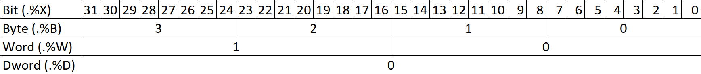

# Expressions

An expression, in contrast to a statement, is evaluated to a value and combined with other expressions for complex computations. An expressions cannot be used as a statement alone but is always part of a statement. The call is an exception of this rule because calls can be used as a statement and as an expression.

## Literals

Literals are the simplest form of expressions. They represent a single unchangeable value. For various types different forms of writing are supported.

### `BOOL` literals

For `BOOL` literals the keywords `FALSE` and `TRUE` are used. You may equivalently use `BOOL#0` and `BOOL#FALSE` or `BOOL#1` and `BOOL#TRUE` respectively.

### Number literals

Number literals represent numbers like `0`, `1`, `2`, `3`, …. There are various formats to write them down.

| Literal kind        | Format                                       | Example(s)                     |
| :------------------ | :------------------------------------------- | :----------------------------- |
| Decimal untyped     | [+-]?[0-9]+                                  | `-1`, `+255`                   |
| Hexadecimal untyped | 16#[0-9A-F]+                                 | `16#1`, `16#FF`                |
| Octal untyped       | 8#[0-7]+                                     | `8#1`, `8#377`                 |
| Binary untyped      | 2#[0-1]+                                     | `2#1`, `2#11111111`            |
| Decimal typed       | _TYPE_#[+-]?[0-9]+                           | `WORD#65535`, `BYTE#255`       |
| Hexadecimal typed   | _TYPE_#16#[0-9A-F]+                          | `UINT#16#FFFF`, `BYTE#16#FF`   |
| Octal typed         | _TYPE_#8#[0-7]+                              | `INT#8#1`, `USINT#8#377`,      |
| Binary typed        | _TYPE_#2#[0-1]+                              | `SINT#2#1`, `USINT#2#11111111` |
| REAL/LREAL typed    | _TYPE_#[+-]?[0-9]+\.[0-9]+([Ee][+-]?[0-9]+)? | `REAL#-1.2E+34`, `LREAL#12.34` |

### String and character literals

Character literals may be written like typed number literals. They may also be written like typed or untyped string literals of length 1.

| Literal kind      | Format              | Example(s)                                |
| :---------------- | :------------------ | :---------------------------------------- |
| Decimal typed     | _TYPE_#[+-]?[0-9]+  | `CHAR#255`, `WCHAR#65535`                 |
| Hexadecimal typed | _TYPE_#16#[0-9A-F]+ | `CHAR#16#FF`, `WCHAR#16#FFFF`,            |
| Octal typed       | _TYPE_#8#[0-7]+     | `CHAR#8#377`, `WCHAR#8#177777`,           |
| Binary typed      | _TYPE_#2#[0-1]+     | `CHAR#2#11111111`, `WCHAR#2#123`,         |
| 1-String untyped  | …                   | `'A'`, `"B"`, `"$0001"` , `'$01'`, `'$$'` |
| 1-String typed    | …                   | `WCHAR#'A'`, `CHAR#'A'`, `WCHAR#"B"`,     |

String literals are either typed or untyped and are delimited by single quotes `'` for CHAR content and by double quotes `"` for WCHAR content. No control characters may be present but can be represented by escape sequences initiated with `$`.

| Literal kind         | Format        | Example(s)                       |
| :------------------- | :------------ | :------------------------------- |
| Single quote untyped | `'.*'`        | `'abc'`, `'123'`                 |
| Single quote typed   | `_TYPE_#'.*'` | `STRING#'123'`, `WSTRING#'123'`  |
| Double quote untyped | `".*"`        | `"abc"`, `"123"`                 |
| Double quote typed   | `_TYPE_#".*"` | `WSTRING#"123"`, `WSTRING#"123"` |

#### String escape sequences

Within strings escape sequences are initiated with a dollar sign `$` followed by various types of sequences:

| Escape sequence             | Format         | Example(s)                               |
| :-------------------------- | :------------- | :--------------------------------------- |
| Escape for dollar sign      | `$$`           | `'This will cost you $$2.'`, `CHAR#'$$'` |
| Escape for line feed        | `$[Ll]`        | `"$L"`, `"$l"`                           |
| Escape for carriage return  | `$[Rr]`        | `'$R'`, `"$r"`                           |
| Escape for new-line (CR+LF) | `$[Nn]`        | `'one line$Nanother line'`, `"$N"`       |
| Escape for horizontal tab   | `$[Tt]`        | `'$T'`, `"Some $t formatting"`           |
| Escape for page feed        | `$[Pp]`        | `'$p'`, `"$P"`                           |
| Escape for single quote     | `$'`           | `STRING#'He said $'oh$'.'`               |
| Escape for double quote     | `$"`           | `WSTRING#"She said $"no$"."`             |
| Escape for CHAR-Hex-Code    | `$[0-9A-F]{2}` | `'She$20jumped$20spaces'`                |
| Escape for WCHAR-Hex-Code   | `$[0-9A-F]{4}` | `"He$0020jumped$0020spaces"`             |

### Date and time literals

The literals for the types `DATE`, `LDATE`, `TIME`, `LTIME`, `TIME_OF_DAY`, `LTIME_OF_DAY`, `DATE_AND_TIME`, `LDATE_AND_TIME` represent points in time and durations.

| Literal kind          | Format           | Types                             | Example(s)                             |
| :-------------------- | :--------------- | :-------------------------------- | :------------------------------------- |
| Date                  | `_TYPE_#%d`      | `DATE`, `LDATE`                   | `DATE#2007-01-09`, `LDATE#2007-06-29`  |
| Date abbrev.          | ~                | `D`, `LD`                         | `D#2007-01-09`, `LD#2007-06-29`        |
| Durations             | `_TYPE_#[+-]?%i` | `TIME`, `LTIME`                   | `TIME#+2.2d`, `LTIME#5ms2us`           |
| Duration abbrev.      | ~                | `T`, `LT`                         | `T#2.2d0ms`, `LT#+5ms2us`              |
| Time of day           | `_TYPE_#%t`      | `TIME_OF_DAY`, `LTIME_OF_DAY`     | `TIME_OF_DAY#13:10:02`                 |
| Time of day abbrev.   | ~                | `TOD`, `LTOD`                     | `TOD#13:10:02.01`, `LTOD#13:10:02.001` |
| Date and time         | `_TYPE_#%d-%t`   | `DATE_AND_TIME`, `LDATE_AND_TIME` | `DATE_AND_TIME#2007-01-09-09:43:00`    |
| Date and time abbrev. | ~                | `DT`, `LDT`                       | `LDT#2007-01-09-09:43:00.0`            |

The above table uses some abbreviations in the format column:

- `%f` represents a decimal number with optional fixpoint, i.e. `[0-9]+('.'[0-9]+)?`,
- `%i` represents a time interval (duration) consisting of a nonempty sequence of days `(%fD)?` hours `(%fH)?`, minutes `(%fM)?`, seconds `(%fS)?`, milli-seconds `(%fMS)?`, micro-seconds `(%fUS)?` and nano-seconds `(%fNS)?`,
- `%t` represents a time of day `[0-9]+:[0-9]+:%f` of the form `hh-mm-ss.ss`,
- `%d` represents a date `[0-9]+-[0-9]+-[0-9]+` of the form `YYYY-MM-DD`.

## Operators

The following table lists all available operators ordered by their precedence from highest to lowest.
The operators `*`, `/`, `+`, `-`, `ROL`, `ROR`, `SHL` and `SHR` are applicable for different data types. Also for some operators the data types must not be equal and the result data type might be different to the operands' data type, see restrictions in the table below.

| Operation                                                       | Syntax Example       | Restrictions                                                                                                                                                                                                                                                      |
| :-------------------------------------------------------------- | :------------------- | :---------------------------------------------------------------------------------------------------------------------------------------------------------------------------------------------------------------------------------------------------------------- |
| Constant evaluation                                             | `1234`               |                                                                                                                                                                                                                                                                   |
| Variable evaluation                                             | `X`                  |                                                                                                                                                                                                                                                                   |
| Name of a function, variable, type or member as String constant | `NAME_OF(X)`         | `NAME_OF` is evaluated at compile time and has no effect at runtime                                                                                                                                                                                               |
| Reference                                                       | `REF(X)`             | The type of `X` must be a none-reference type.                                                                                                                                                                                                                    |
| Member access                                                   | `instance.member`    |                                                                                                                                                                                                                                                                   |
| Array access                                                    | `array[index]`       | `index` must be of integer data type (e.g. `INT`). An access may lead to an out-of-bounds error.                                                                                                                                                                  |
| Indexed String access                                           | `myString[index]`    | `index` must be of integer data type (e.g. `INT`) and be strictly greater than 0 (acc. to IEC61131-1 the access to a `STRING` is 1-based). An access may lead to an out-of-bounds error. In addition, passing `myString[index]` to a `VAR_IN_OUT` is not allowed. |
| Subexpression evaluation                                        | `(A + B)`            |                                                                                                                                                                                                                                                                   |
| Invocation                                                      | `F(Z := A)`          |                                                                                                                                                                                                                                                                   |
| Dereference                                                     | `X^`                 | The type of `X` must be a [reference type](./04_types-and-variables.md#reference-data-types) (`REF_TO <some_type>`)                                                                                                                                               |
| Complement                                                      | `NOT X`              | The operand must be of type `BOOL`                                                                                                                                                                                                                                |
| Exponentiation                                                  | `X ** Y`             | The base must be any `REAL`, the exponent can be any `REAL` or `ANY_NUM` data type (e.g. `INT`). Please note that mixing real data types between base and exponent is not possible. E.g. `REAL ** LREAL`.                                                         |
| Multiplication                                                  | `X * Y`              | Operands of `ANY_NUM` data types (e.g. `INT` or `REAL`) are commutative and must be of equal type, operands of data types `ANY_TIME` must be given first followed by a `ANY_NUM` (Note: not all combinations valid, s. IEC61131-3)                                |
| Division                                                        | `X / Y`              | Operands of `ANY_NUM` data types must be equal, operands of data types `ANY_TIME` must be given first followed by an `ANY_NUM` (Note: not all combinations are valid, s. IEC61131-3)                                                                              |
| Remainder                                                       | `X MOD Y`            | Operands must be of integer data types (e.g. `INT`)                                                                                                                                                                                                               |
| Addition                                                        | `X + Y`              | Result date type is `ANY_DATE` in case `ANY_DATE` - `ANY_DURATION`, otherwise the result data type is `ANY_MAGNITUDE`; operator is invalid for other data types                                                                                                   |
| Subtraction                                                     | `X - Y`              | Result date type is `ANY_DATE` in case `ANY_DATE` - `ANY_DURATION`, in case `ANY_DATE` - `ANY_DATE` the result data type is `ANY_TIME`, otherwise the result data type is `ANY_MAGNITUDE`; operator is invalid for other data types                               |
| Equality                                                        | `X = Y`              |                                                                                                                                                                                                                                                                   |
| Less than                                                       | `X < Y`              | Operands must have an order                                                                                                                                                                                                                                       |
| Greater than                                                    | `X > Y`              | Operands must have an order                                                                                                                                                                                                                                       |
| Inequality                                                      | `X <> Y`             |                                                                                                                                                                                                                                                                   |
| Less or equal than                                              | `X <= Y`             | Operands must have an order                                                                                                                                                                                                                                       |
| Greater or equal than                                           | `X >= Y`             | Operands must have an order                                                                                                                                                                                                                                       |
| Conjunction                                                     | `X AND Y` or `X & Y` | Operands must be of bit-aware data types (e.g. `BOOL`)                                                                                                                                                                                                            |
| Exclusive disjunction                                           | `X XOR Y`            | Operands must be of bit-aware data types (e.g. `BOOL`)                                                                                                                                                                                                            |
| Disjunction                                                     | `X OR Y`             | Operands must be of bit-aware data types (e.g. `BOOL`)                                                                                                                                                                                                            |
| Rotate left                                                     | `ROL(X, Y)`          | `X` must be of bit-aware data type, `Y` must be an unsigned integer type                                                                                                                                                                                          |
| Rotate right                                                    | `ROR(X, Y)`          | `X` must be of bit-aware data type, `Y` must be an unsigned integer type                                                                                                                                                                                          |
| Shift left                                                      | `SHL(X, Y)`          | `X` must be of bit-aware data type, `Y` must be an unsigned integer type                                                                                                                                                                                          |
| Shift right                                                     | `ROL(X, Y)`          | `X` must be of bit-aware data type, `Y` must be an unsigned integer type                                                                                                                                                                                          |
| Partial access                                                  | `X.%W1`              | See [detailed explanation below](#partial-variable-access)                                                                                                                                                                                                        |
| Conversion                                                      | `TO_<TYPE>(X)`       | Explicitly converts `X` in the datatype `<TYPE>` acc. to [table in IEC61131-3](./04_types-and-variables.md#type-conversion)                                                                                                                                       |

**_Evaluation of operations_**

Operations with a higher precedence are evaluated before operations with lower precedence.
Operations of the same precedence and operations with two operands are evaluated from left to right (left associative), meaning the expression `a + b + c` is evaluated like `(a + b) + c`

Member accesses are right associative, means the expression `w.x.y.z` is evaluated like `w.(x.(y.(z)))`.


### Partial variable access

Variables of all numeric and bit data types (except `BOOL`) support access to parts of their values.
A partial access needs to specify an access width and an offset, similarly to [directly represented variables](04_types-and-variables.md#directly-represented-variables).
The offset depends on the access width, is zero-based and starts from the least significant bit.

The following table shows how the offset is interpreted when accessing a `DWORD` variable:



**_Examples:_**

```iecst
FUNCTION MyFunction
    VAR_TEMP
        MyBool: BOOL;
        MyByte: BYTE;
        MyWord: WORD;
        MyDWord: DWORD;
        MyLWord: LWORD;
    END_VAR
    MyBool := MyByte.%X0; // Read the first bit of MyByte
    MyWord.%B1 := MyByte; // Write MyByte to second byte of MyWord
    MyBool := MyDWord.%X15; // Read the 16th bit of MyDWord
    MyLWord.%W1 := MyWord; // Write MyWord to the second word of MyLWord
    MyWord := MyLWord.%W1; // Read the second word of MyLWord
    MyByte := MyLWord.%B1; // Read the second byte of MyLWord

END_FUNCTION
```

> TIP
>
> In contrast to the IEC norm it is mandatory to specify the access width explicitly.

## Calls

Invocations are used to call [functions](./01_program-structure/2_program-organization-unit.md#function-declaration) or [methods](./01_program-structure/2_program-organization-unit.md#class-declaration).


### Formal calls

This is the _formal way_ of performing an invocation. During the call the _formal_ parameters are mentioned explicitly when assigning an argument to it. The assignment operators `:=` and `=>` are used to assign an argument according to the [declaration](04_types-and-variables.md#variable-declaration) of the function's variables. Only variables of the section `VAR_INPUT`, `VAR_OUTPUT` and `VAR_IN_OUT` are treated as call parameters and can be assigned in a call. Because the formal parameter name is explicitly given, the order of arguments in the call is arbitrary.

When performing a formal call, all parameters, except for `VAR_IN_OUT`, can be left out. If a parameter is left out, the optional initial value or [default value](./04_types-and-variables.md#initial-values) of the variable will be used as argument. When reading from parameters in `VAR_OUTPUT` inside the callee, the passed argument has precedence over the initial value given during declaration.

#### Example: Formal calls

```iecst
PROGRAM Invocation
    VAR_TEMP
        a : INT := 10;
        b : INT;
    END_VAR

    a := Func(in := 1, inout := a, out => b); // arguments: in = 1, out = b.
    a := Func(inout := a, out => b, in := 1); // order does not matter
    a := Func(inout := a); // arguments: in = 100, out = 110.
END_PROGRAM

FUNCTION Func : INT
    VAR_INPUT
        in : INT := 100;
    END_VAR
    VAR_OUTPUT
        out : INT := 110;
    END_VAR
    VAR_IN_OUT
        inout : INT;
    END_VAR

    out:= in * out;
    Func := out + inout;
END_FUNCTION
```

### Informal calls

Unlike formal calls, informal calls do not need explicit mention of the formal parameter name. You may directly pass in the arguments in the call considering the order in which they are declared in the called function or method. The same parameter passing rules as for formal calls apply also to informal calls. Furthermore, it is not possible to leave out arguments during the invocation. The argument list have to be complete.

> TIP
>
> You may not combine informal and formal call styles in the same call.

#### Example: Informal call

```iecst
FUNCTION Callee : INT
    VAR_INPUT
        in : INT;
    END_VAR
    VAR_TEMP
        temp : INT;
    END_VAR
    VAR_OUTPUT
        out : INT;
    END_VAR
    VAR_IN_OUT
        inout : INT;
    END_VAR

    Callee := 0;
END_FUNCTION

PROGRAM Invocation
    VAR_TEMP
        a,b : INT;
    END_VAR

    a := 10;
    a := Callee(1, a, b); //same as Callee(in := 1, inout := a, out => b);
END_PROGRAM
```

### Overloading

Overloading of functions and methods allows the programmer to use _one_ function/method name with different formal parameters. This enables a kind of generic programming as one does not have to bind to a specific function name.
**Note**: overloading is not applicable for `FUNCTION_BLOCK`s.

The call of such a function is bound to the function using its actual parameters.
In general, the rules for binding to a function declaration are as follows:

- The signature of a function is given by the function's name and the parameters' formal name and type. _The return value is not part of the signature._
- Formal calls match, when the function's **name** and **formal parameters** and **their type** do match.
- Informal calls match, when the function's **name** and **order** and **type** of actual parameters fit to the order and type of the formal parameters.
- When using [namespaces](./01_program-structure/3_namespaces.md), [shadowing](./01_program-structure/3_namespaces.md#shadowing) must be taken into account.

The compiler applies several filtering steps to bind a call to one function/method out of a set of functions/methods that share the same name. After each step, the amount of valid functions/methods that might be called will decrease. In case, after the last step, more than 1 function/method is possible, the call we be marked as ambiguous. As soon as the valid set of functions/methods has only 1 element left, the procedure ends without applying the rest of the filtering steps.

The steps are as follows:

- Step 1: The name of the called function/method is the same as the name of the declared function/method.
- Step 2: The actual parameters must match with the formal parameters:
  - a) Calls with given parameter names (so called 'formal calls'):<br>
    The actual parameters match in type and name with the formal parameters. _Note_: In case there are more formal parameters than actual parameters provided, the missing parameters will fallback to their [default values](./04_types-and-variables.md#initial-values).
  - b) Calls without given parameter names (so called 'informal calls'):<br>
    The actual parameters match in type and position with the formal parameters. _Note_: Acc. to the norm the number of actual parameters must exactly fit to the number of formal parameters. Hence, default values will not be applied.
- Step 3: In case of formal calls the functions/methods with the least number of needed default values for parameters are taken.
- Step 4: In case of a method call, the static type of its instance determines the valid methods. This rule only has an effect in case of using inheritance.
- Step 5: Functions/methods with the least needed implicit type conversion for parameter passing are removed from the valid set. _Note_: The depth of needed implicit type conversions per parameter is _not_ taken into account.
- Step 6: Functions/methods of the closest namespace are taken. _Note_: To make clear, what 'closest' means: A call in `NAMESPACE A.B.C` to a function that is declared in `NAMESPACE A` and in `NAMESPACE A.B` will be bound to the function in `NAMESPACE A.B`.

If none of the above strategies can resolve the function call, the compiler tries to find a list of function declarations that matches with a maximum amount of matching parameters. The found candidates are presented as a compiler message.

The following examples shows how overloading works.

#### Example: Overloading

Example 1: Implementation of an exponentiation function for unsigned integer types that is not available by standard ST (**NOTE**: The example is not a best practice for the exponentiation of unsigned integer typed variables, e.g.: overflows may occur).

```iecst
FUNCTION MyExp : ULINT
    VAR_INPUT
        in1 : UINT;
        in2 : UINT;
    END_VAR
    VAR_TEMP
        res : ULINT;
        tmp : UINT;
        converted_in1 : ULINT;
    END_VAR

    res := ULINT#1;
    converted_in1 := TO_ULINT(in1);
    FOR tmp := UINT#0 TO in2 DO
        res := res * converted_in1;
    END_FOR;
    MyExp := res;

END_FUNCTION

FUNCTION MyExp : ULINT
    VAR_INPUT
        in1 : REAL;
        in2 : REAL;
    END_VAR

    MyExp := TO_ULINT(in1 ** in2);

END_FUNCTION

FUNCTION CallingExample : ULINT
    VAR_TEMP
        tmp_uint : UINT;
        tmp_real : REAL;

        int_exp : ULINT;
        pi_exp_as_int : ULINT;
    END_VAR

    (* Let the compiler decide, which function is meant. *)
    int_exp := MyExp(in1 := UINT#6, in2 := UINT#8);
    pi_exp_as_int := MyExp(REAL#3.1415, REAL#3.1415 * REAL#3.1415);

    CallingExample := int_exp + pi_exp_as_int;

END_FUNCTION
```

Example 2: Using formal parameter names that specify the function to be called.

```iecst
FUNCTION func
    VAR_INPUT
        a : INT;
        b : INT;
    END_VAR
    // some code
    ;
END_FUNCTION

FUNCTION func
    VAR_INPUT
        a : INT;
        c : INT;
    END_VAR
    // some code
    ;
END_FUNCTION

FUNCTION CallingExample
    VAR_TEMP
        tmp_int : INT;
    END_VAR

    (* Does compile: There is only 1 function 'func' with a formal parameter named 'c' and type int *)
    func(c := tmp_int);
END_FUNCTION
```

Example 3: A function call, that can be resolved to more than one function declaration (the contents of the functions are of no interest).

```iecst
FUNCTION func
    VAR_INPUT
        a : INT;
        b : INT;
    END_VAR
    // some code
    ;
END_FUNCTION

FUNCTION func
    VAR_INPUT
        a : INT;
        c : INT;
    END_VAR
    // some code
    ;
END_FUNCTION

FUNCTION Caller
    (* Causes unresolved function call: Both 'func(a : INT, b: INT)' and 'func(a: INT, c: INT)' do fit. *)
    func(5);

    (* Causes unresolved function call: Both 'func(a : INT, b: INT)' and 'func(a: INT, c: INT)' do fit. *)
    func(a := 5);
END_FUNCTION
```

Example 4: No function declaration can be found, but the compiler lists all declarations that come as close as possible.

```iecst
// There is no function called 'F' that has 'INT' as second parameter.
FUNCTION F : INT
    VAR_INPUT
        X : INT;
    END_VAR
    F := X + 2;
END_FUNCTION
FUNCTION F : INT
    VAR_INPUT
        X : SINT;
    END_VAR
    F := X + TO_SINT(1);
END_FUNCTION
FUNCTION Caller
    VAR_TEMP
        tmp : INT;
    END_VAR

    (* Causes an unresolved function call: the parameter type 'DINT' cannot be implicitly converted to 'SINT' or 'INT'. But 'F(INT)' and 'F(SINT)' comes closest to the call. *)
    tmp := F(DINT#5);
END_FUNCTION
```

## Constant expressions

Constant Expressions evaluate to a fixed, compile time determined value.
At certain syntax locations (such as constant declarations, variable and field initializers, initializers of elementary data types) the compiler expects constant expressions and otherwise reports an appropriate error.

```iecst
CONFIGURATION PLC_1
    VAR_GLOBAL CONSTANT
        CONST_LITERAL_INT : INT := 10;
        CONST_SUM_INT : INT := 7 + INT#5;
        CONST_MUL_INT : INT := (7 + 2) * CONST_SUM_INT;
        CONST_TRUE_BOOL : BOOL := TRUE OR FALSE;
        CONST_FALSE_BOOL : BOOL := TRUE AND FALSE XOR NOT TRUE;
        CONST_ADD_REAL : REAL := REAL#0.0 + REAL#1.0;
    END_VAR
    TASK Main(Interval := T#1000ms, Priority := 1);
    PROGRAM P1 WITH Main : SampleProgram;
END_CONFIGURATION

PROGRAM SampleProgram /* name of the program */
    VAR_EXTERNAL CONSTANT
        CONST_LITERAL_INT : INT;
        CONST_SUM_INT : INT;
        CONST_TRUE_BOOL : BOOL;
        CONST_FALSE_BOOL : BOOL;
    END_VAR
    VAR CONSTANT
        alwaysTrue : BOOL := TRUE;
        b : BOOL := alwaysTrue;
    END_VAR
    VAR_TEMP
        t_false : BOOL := CONST_FALSE_BOOL;
        t_true : BOOL := CONST_TRUE_BOOL XOR CONST_FALSE_BOOL;
    END_VAR
    ;
END_PROGRAM
```

Notice that the compiler treats and accepts only a basic set of operations on elementary data types as constant expressions. Support for `string`-, `time`- and `date`-types is currently restricted to the use of literals or identifiers of constants. In addition, a `string`-type can be accessed via an index (just like an array).

## NAME_OF expression

A NAME_OF expression produces the name of a function, variable, type or member as string. It is treated as a constant expression and therefore evaluated during compile time and has no effect on the runtime.

```iecst
    x := name_of(myGlob);                               // x := 'myGlob'
    x := name_of(x);                                    // x := 'x'
    x := name_of(myfb.y);                               // x := 'y'
    x := name_of(fb1.y);                                // x := 'y'
    x := name_of(MyDatatype);                           // x := 'MyDatatype'
    x := name_of(MyStruct1);                            // x := 'MyStruct1'
    x := name_of(MyStruct1.x);                          // x := 'MyStruct1'
    x := name_of(MyStruct1.innerstruct.x);              // x := 'x'
    x := name_of(Colors);                               // x := 'Colors'
    x := name_of(Colors#GREEN);                         // x := 'GREEN'
    x := name_of(MyClass);                              // x := 'MyClass'
    x := name_of(MyClass.x);                            // x := 'x'
    x := name_of(MyClass.myMethod);                     // x := 'myMethod'
    x := name_of(returnsStruct().x);                    // x := 'x'
    x := name_of(arr[0].x);                             // x := 'x'

    //lookup only in current namespace but not in parent
    x := name_of(MyClass.x);                            // x := 'x'
    x := name_of(NS1.NS2.bar);                          // x := 'bar'
    x := name_of(NS1.NS2);                              // x := 'NS2'
```
