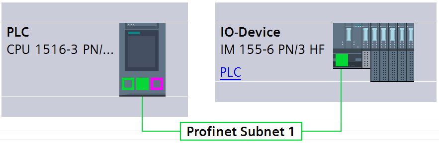
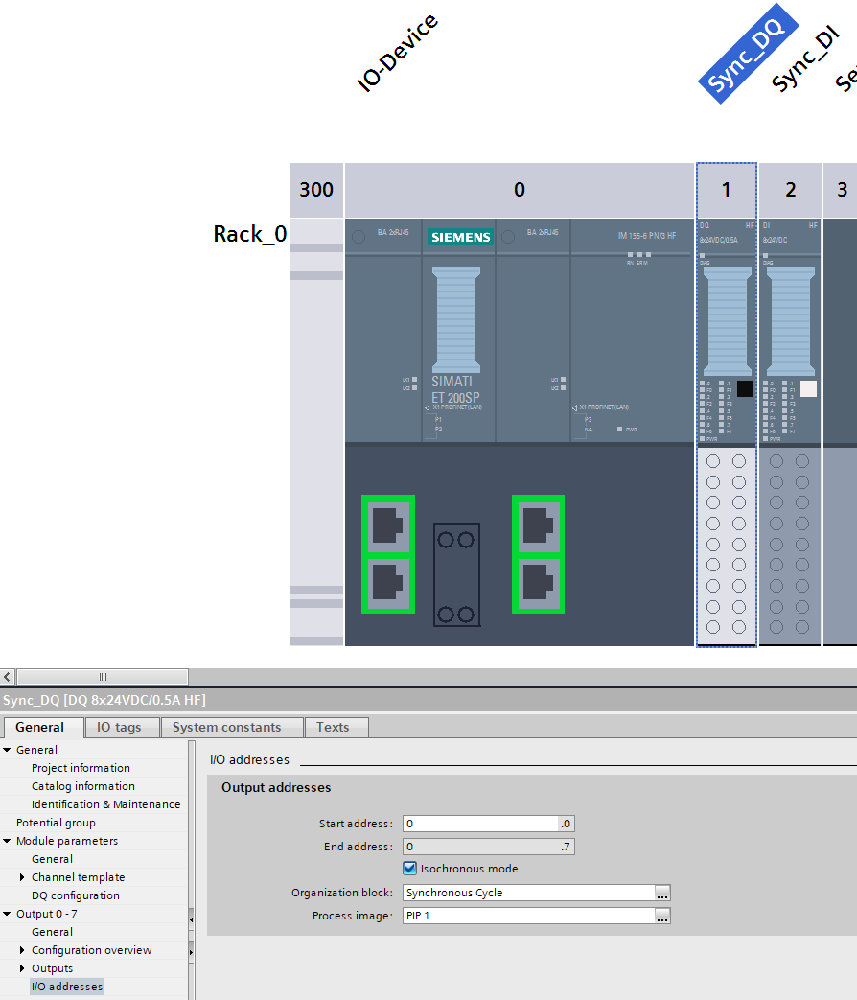
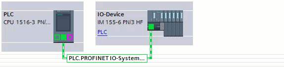
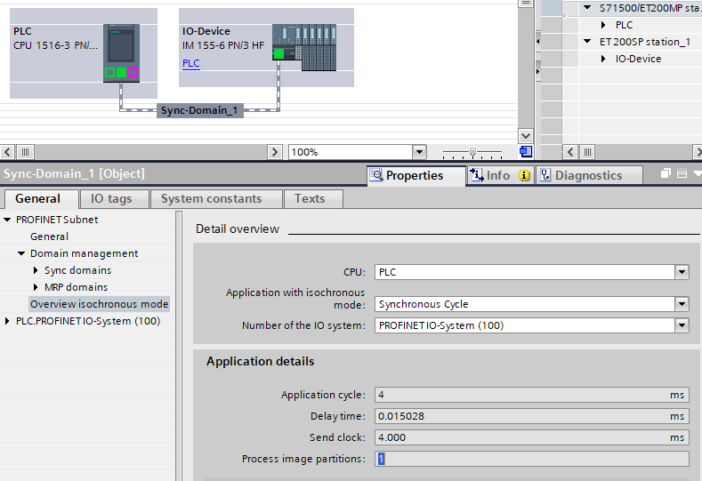

# Synchronous Tasks TIA Instructions

The following describes the steps necessary to use the Isochronous Realtime (IRT) mode on the S7-1500 PLC.

## TIA Portal setup

### Networking

To use the isochronous mode, a PLC and an IO Device need to be connected via PROFINET and need to be IRT capable.

> TIP
>
> The devices need to be connected in the 'Topology View'.



### IO Configuration

Set the IO modules to isochronous mode and assign a Process Image Partition (PIP).

> TIP
>
> TIA Portal will create a new synchronous OB; this will be replaced when loading an AX project.



### Sync Domain

Selecting the sync domain properties.





The necessary information, for the task configuration, is displayed in the 'Overview isochronous mode' page.

_Configuration parameters:_

| Name                  | Data type | Description                                                                                                                                                                     |
| --------------------- | --------- | ------------------------------------------------------------------------------------------------------------------------------------------------------------------------------- |
| IoSystemNumber        | UDINT     | The IO system number for the sync domain. In the example above: `100`.                                                                                                          |
| ProcessImagePartition | UINT      | The process image partition for the sync domain. In the example above: `1`.                                                                                                     |
| DelayTime             | TIME      | The communication delay time of the sync domain. In the example above: `15028ns` ns                                                                                             |
| CycleReductionFactor  | UINT      | The factor that describes after how many cycles to trigger program execution. In TIA Portal terms, it is the factor of 'Application cycle' to 'Send clock': 4ms / 4.000ms = `1` |

_Example usage:_

```iecst
CONFIGURATION Cfg
    TASK MySynchronousCycleTask : Siemens.Simatic.S71500.SynchronousCycle := (
        IoSystemNumber := UDINT#100,
        ProcessImagePartition := UINT#1,
        DelayTime := TIME#15028ns,
        CycleReductionFactor := UINT#1
    );
    PROGRAM MySynchronousCycleProgram WITH MySynchronousCycleTask : Prg;
END_CONFIGURATION

PROGRAM Prg
    ;
END_PROGRAM
```
